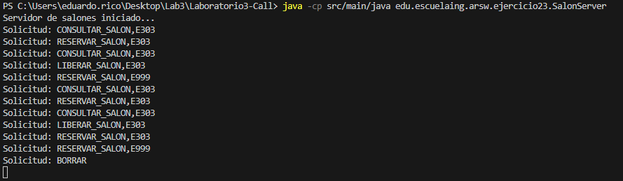
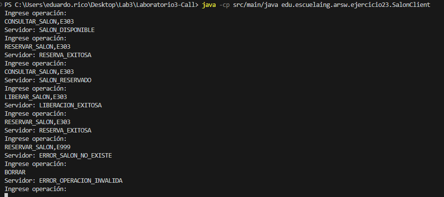
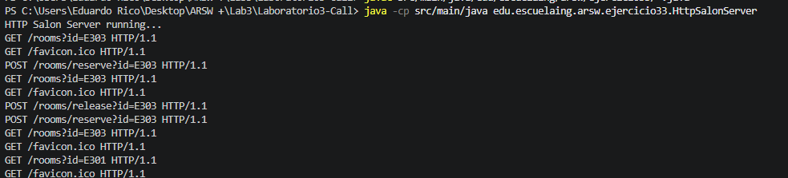
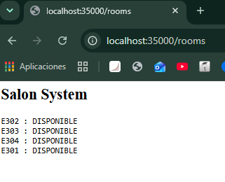
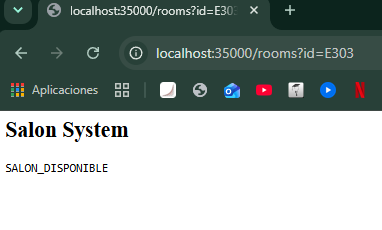
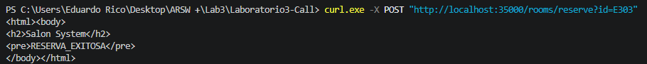
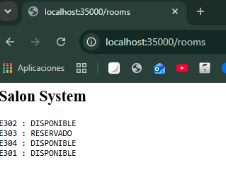
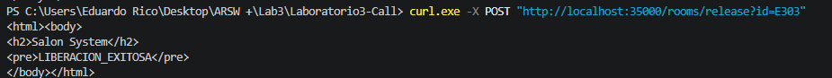

# Laboratorio3-Call

# Exercise 2.3 - Room Management System using TCP

## Objective

To design and implement a client-server application using TCP sockets in Java to manage classroom reservations at the School.

The system allows clients to query the status of a room, reserve available rooms, and release previously reserved rooms through a text-based communication protocol.

---

# Theoretical Background

The solution uses the client-server model through the TCP protocol.

TCP allows reliable communication between two applications by establishing a connection-oriented communication channel. The client sends requests to the server, and the server processes the request and returns a response.

In this exercise, a custom text-based communication protocol was defined:

```text
OPERATION,ROOM
```

The supported operations are:

```text
CONSULTAR_SALON,E303
RESERVAR_SALON,E303
LIBERAR_SALON,E303
```

The server maintains the state of the rooms in memory and controls all requested operations.

---

# Exercise Development

A room management system was implemented using three main classes:

## SalonServer

The server application is responsible for:

* Listening for TCP connections on port `35000`.
* Receiving client requests.
* Processing requested operations.
* Returning responses to clients.

---

## SalonClient

The client application allows users to send requests to the server.

The user can enter commands such as:

```text
CONSULTAR_SALON,E303
```

and receive the corresponding response.

---

## SalonManager

This component contains the business logic of the system.

The initial available rooms are:

```text
E301
E302
E303
E304
```

Each room can have two states:

```text
Available
Reserved
```

Implemented operations:

| Operation            | Response                 |
| -------------------- | ------------------------ |
| Query available room | SALON_DISPONIBLE         |
| Query reserved room  | SALON_RESERVADO          |
| Reserve room         | RESERVA_EXITOSA          |
| Release room         | LIBERACION_EXITOSA       |
| Non-existing room    | ERROR_SALON_NO_EXISTE    |
| Invalid operation    | ERROR_OPERACION_INVALIDA |

---

# Communication Protocol

Example request:

Client:

```text
RESERVAR_SALON,E303
```

Server:

```text
RESERVA_EXITOSA
```

Example query:

Client:

```text
CONSULTAR_SALON,E303
```

Server:

```text
SALON_RESERVADO
```

---

# Execution Commands

## Compilation

From the project root:

```bash
javac src/main/java/edu/escuelaing/arsw/ejercicio23/*.java
```

---

## Run Server

```bash
java -cp src/main/java edu.escuelaing.arsw.ejercicio23.SalonServer
```

Expected output:

```text
Room management server started...
```

---

## Run Client

In another terminal:

```bash
java -cp src/main/java edu.escuelaing.arsw.ejercicio23.SalonClient
```


---

# Results Analysis

The application successfully implemented TCP communication between a client and a server.

The server maintains the room state in memory and correctly responds according to the requested operation.

Synchronization was also applied to critical operations to avoid inconsistencies when multiple clients attempt to modify the state of the same room simultaneously.

---

# Evidence

## Server Execution



## Client Execution



---

# Reflection Questions

## How easy would it be to add a new operation to the protocol?

Adding a new operation would be simple because the protocol is based on text commands.

For example, a new operation:

```text
CHANGE_STATUS,E303
```

could be added by modifying the server logic and including a new condition in the command processor.

However, as the number of operations grows, it would be better to use a more formal protocol with structured messages.

---

## What happens if two clients try to reserve the same room at the same time?

If two clients attempt to reserve the same room simultaneously, a concurrency problem could occur.

To prevent this situation, synchronization was implemented on operations that modify the room state.

This guarantees that only one client can reserve the room first, while the second client receives:

```text
SALON_RESERVADO
```

---

## Where is the communication contract actually defined: in a formal file or in text conventions?

In this implementation, the communication contract is defined through text conventions.

The client and server must previously know the valid commands:

```text
OPERATION,ROOM
```

There is no formal contract file describing the protocol.

In more advanced systems such as gRPC, contracts are defined using `.proto` files, allowing more structured communication.

---

# Conclusions

1. TCP sockets allow the construction of distributed systems using the client-server model.
2. A clear communication protocol is essential for interaction between applications.
3. Shared state must be carefully managed to avoid concurrency problems.
4. Separating business logic from server communication improves system organization and maintainability.
5. This exercise represents an evolution from basic socket communication towards distributed services with more structured contracts.

---


# Exercise 3.3 - Room Management via HTTP

## Objective

Transform the previously developed room management system using TCP into a service based on HTTP.

The objective is to understand how a custom communication protocol can be replaced by clearer HTTP routes, allowing clients such as browsers, Postman, or tools like curl to interact with the server.

---

# Theoretical Framework

This exercise uses the HTTP protocol over a client-server architecture.

Unlike the previous TCP-based exercise, where custom messages were sent such as:

```
RESERVAR_SALON,E303
```

HTTP defines a structure based on:

* HTTP Method (GET, POST)
* Resource path
* Parameters

Example:

```
GET /rooms?id=E303
```

The communication is performed through HTTP requests and responses, where the server processes the request and returns a response in plain text or HTML.

---

# Exercise Development

An HTTP server was implemented using Java basic classes:

* `ServerSocket`
* `Socket`
* Input and output streams

---

# System Operation

The server maintains the rooms in memory:

```
E301
E302
E303
E304
```

Each room can have two states:

```
AVAILABLE
RESERVED
```

---

# Execution Commands

## Compilation

From the project root:

```bash
javac src/main/java/edu/escuelaing/arsw/ejercicio33/*.java
```

---

## Running the server

```bash
java -cp src/main/java edu.escuelaing.arsw.ejercicio33.HttpSalonServer
```

Expected output:

```
HTTP Salon Server running...
```

The server remains waiting for requests.



---

# Tests Performed

## Query all rooms

Request:

```
GET /rooms
```

Example:

```
http://localhost:35000/rooms
```

Response:

```
E301 : AVAILABLE
E302 : AVAILABLE
E303 : AVAILABLE
E304 : AVAILABLE
```



---

## Query a specific room

Request:

```
GET /rooms?id=E303
```

Example:

```
http://localhost:35000/rooms?id=E303
```

Response:

```
ROOM_AVAILABLE
```



---

## Reserve a room

Request:

```
POST /rooms/reserve?id=E303
```

Command:

```bash
curl.exe -X POST "http://localhost:35000/rooms/reserve?id=E303"
```

Response:

```
RESERVATION_SUCCESSFUL
```




---

## Release a room

Request:

```
POST /rooms/release?id=E303
```

Command:

```bash
curl.exe -X POST "http://localhost:35000/rooms/release?id=E303"
```

Response:

```
RELEASE_SUCCESSFUL
```



---

# Analysis

The implementation demonstrates how a client-server system can evolve from a custom text-based protocol into an HTTP-based architecture.

HTTP provides a more organized way to define operations through routes and methods, making the service easier to consume from different clients.

The server keeps the business logic separated from the communication handling, allowing better code organization.

---

# Reflection Questions

## What advantages does HTTP offer compared to a manually defined text protocol?

HTTP provides a standard communication structure that is already supported by multiple clients such as browsers, testing tools, and applications.

Additionally, it clearly separates:

* The action through the HTTP method.
* The resource through the URL.
* The parameters through queries.

For example:

```
POST /rooms/reserve?id=E303
```

is more descriptive than:

```
RESERVAR_SALON,E303
```

It also makes integration with other systems easier.

---

## What limitations does building an HTTP server without a framework have?

Building an HTTP server manually helps understand how communication works, but it has several limitations:

* HTTP requests must be interpreted manually.
* There are no automatic validations.
* Error handling becomes more complex.
* It does not include advanced features such as security, session management, or automatic serialization.

Frameworks such as Spring Boot simplify these tasks and allow the development of more robust services.

---

## How would this solution change if JSON was used instead of HTML?

If JSON was used, responses would contain structured data instead of HTML pages.

Example:

```json
{
  "room": "E303",
  "status": "RESERVED"
}
```

This would allow other programs to consume the information easily.

Additionally, JSON facilitates communication between distributed applications because it does not depend on a visual interface.

---

# Conclusions

1. HTTP allows the construction of more flexible and easier-to-consume services than custom protocols.
2. HTTP methods and routes work as a communication contract between client and server.
3. Separating business logic from server communication improves system evolution.
4. Manual implementation allows understanding the internal operation of HTTP.
5. In real applications, using frameworks and structured formats such as JSON would be recommended.


