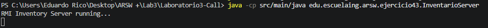
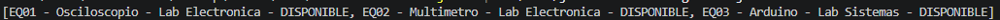
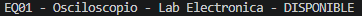

# Ejercicio 4.3 - Inventario de Laboratorios utilizando RMI

## Objetivo

Implementar un sistema distribuido utilizando **RMI (Remote Method Invocation)** para gestionar el inventario de equipos de laboratorio.

El objetivo es diseñar una interfaz remota que permita a un cliente consultar, reservar y liberar equipos ubicados en un servidor remoto, evitando el uso de protocolos basados en mensajes de texto.

---

# Marco Teórico

RMI (Remote Method Invocation) es una tecnología de Java que permite invocar métodos de un objeto que se encuentra ejecutándose en otra máquina o proceso.

A diferencia de los ejercicios anteriores donde se utilizaban protocolos propios mediante TCP o rutas HTTP, en RMI el cliente trabaja con una interfaz remota y realiza llamadas a métodos como si el objeto estuviera localmente.

El contrato de comunicación está definido mediante una interfaz que extiende:

```java
java.rmi.Remote
```

y sus métodos deben declarar:

```java
throws RemoteException
```

La arquitectura utilizada es:

```
Cliente RMI
      |
      |
Interfaz Remota
      |
      |
Objeto Remoto
      |
      |
Servidor
```

---

# Desarrollo del Ejercicio

Se implementó un sistema de inventario de laboratorios usando RMI.

---

# Funcionamiento del Sistema

El servidor mantiene en memoria los equipos disponibles:

```
EQ01 - Osciloscopio - Lab Electronica
EQ02 - Multimetro - Lab Electronica
EQ03 - Arduino - Lab Sistemas
```

Cada equipo posee:

* Código del equipo
* Nombre
* Laboratorio
* Estado

Estados posibles:

```
DISPONIBLE
RESERVADO
```

---

# Interfaz Remota

El contrato de comunicación se definió mediante la interfaz:

```java
InventarioRemote
```

Métodos disponibles:

```java
List<String> consultarEquipos()

String consultarEquipo(String codigo)

boolean reservarEquipo(String codigo)

boolean liberarEquipo(String codigo)
```

Estos métodos pueden ser invocados remotamente por el cliente.

---

# Comandos de Ejecución

## Compilación

Desde la raíz del proyecto:

```bash
javac src/main/java/edu/escuelaing/arsw/ejercicio43/*.java
```

---

## Ejecutar servidor RMI

En una primera terminal:

```bash
java -cp src/main/java edu.escuelaing.arsw.ejercicio43.InventarioServer
```

Salida esperada:

```
RMI Inventory Server running...
```

El servidor queda publicado esperando conexiones.



---

## Ejecutar cliente RMI

En una segunda terminal:

```bash
java -cp src/main/java edu.escuelaing.arsw.ejercicio43.InventarioClient
```

---

# Pruebas Realizadas

## Consultar todos los equipos

Solicitud:

```
consultarEquipos()
```

Respuesta:

```
EQ01 - Osciloscopio - Lab Electronica - DISPONIBLE

EQ02 - Multimetro - Lab Electronica - DISPONIBLE

EQ03 - Arduino - Lab Sistemas - DISPONIBLE
```



---

## Consultar un equipo específico

Solicitud:

```
consultarEquipo("EQ01")
```

Respuesta:

```
EQ01 - Osciloscopio - Lab Electronica - DISPONIBLE
```


---

## Reservar equipo

Solicitud:

```
reservarEquipo("EQ01")
```

Respuesta:

```
true
```

Luego de la reserva:

```
EQ01 - Osciloscopio - Lab Electronica - RESERVADO
```


---

## Liberar equipo

Solicitud:

```
liberarEquipo("EQ01")
```

Respuesta:

```
true
```

Estado final:

```
EQ01 - Osciloscopio - Lab Electronica - DISPONIBLE
```

---

# Análisis

La implementación muestra la diferencia entre utilizar protocolos basados en mensajes y utilizar una comunicación orientada a objetos.

Con RMI, el cliente no necesita conocer cómo está implementada la lógica del servidor, solamente necesita conocer la interfaz remota.

Esto permite un diseño más organizado, donde el contrato de comunicación está definido mediante métodos Java.

Además, se aplicó sincronización en las operaciones de reserva y liberación para evitar inconsistencias cuando múltiples clientes intenten modificar el mismo equipo.

---

# Preguntas de Reflexión

## ¿Qué cambió al pasar de HTTP a RMI?

Al pasar de HTTP a RMI cambia principalmente la forma de comunicación.

En HTTP el cliente realiza solicitudes mediante rutas:

```
POST /rooms/reserve?id=E303
```

y el servidor interpreta manualmente estas peticiones.

En RMI el cliente llama directamente métodos del objeto remoto:

```java
reservarEquipo("EQ01")
```

Esto hace que la comunicación sea más cercana al paradigma orientado a objetos.

---

## ¿Dónde está definido el contrato de comunicación?

El contrato está definido en la interfaz remota:

```java
InventarioRemote
```

Esta interfaz especifica qué métodos están disponibles y qué parámetros reciben.

A diferencia de los ejercicios anteriores donde el contrato estaba basado en convenciones de texto, aquí existe una definición formal en código.

---

## ¿Qué problemas tendría este sistema si un cliente no está escrito en Java?

RMI está diseñado principalmente para aplicaciones Java.

Un cliente desarrollado en otro lenguaje tendría dificultades porque debe conocer:

* La interfaz remota.
* El mecanismo de serialización de Java.
* El protocolo interno utilizado por RMI.

Para sistemas heterogéneos sería más recomendable utilizar tecnologías como:

* REST
* HTTP
* JSON
* gRPC

que permiten comunicación entre diferentes lenguajes.

---

# Conclusiones

1. RMI permite construir sistemas distribuidos utilizando llamadas remotas orientadas a objetos.
2. La interfaz remota funciona como un contrato formal entre cliente y servidor.
3. Comparado con HTTP, RMI reduce la necesidad de interpretar mensajes manualmente.
4. El manejo del estado compartido requiere sincronización para evitar problemas de concurrencia.
5. Para sistemas con diferentes tecnologías, protocolos estándar como REST o JSON suelen ser más adecuados.

---
