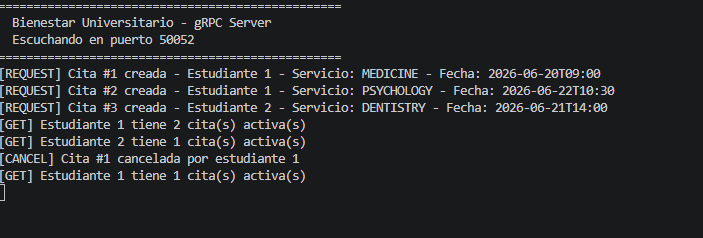
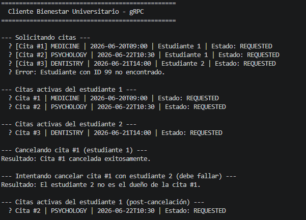

# Ejercicio 5.3 - Sistema de Bienestar Universitario con gRPC

## Objetivo

Implementar un servicio gRPC para gestionar solicitudes de citas del sistema de bienestar universitario.

El objetivo principal es comprender cómo diseñar un contrato de comunicación utilizando Protocol Buffers y cómo dos aplicaciones distribuidas pueden comunicarse sin depender de protocolos de texto creados manualmente.

El sistema permite:

- Solicitar citas.
- Cancelar citas.
- Consultar citas activas de un estudiante.

Toda la información se mantiene en memoria dentro del servidor.

---

# Marco Teórico

Este ejercicio utiliza **gRPC (Google Remote Procedure Call)** como mecanismo de comunicación entre cliente y servidor.

A diferencia de los ejercicios anteriores basados en TCP o HTTP, donde era necesario definir mensajes de texto manualmente, gRPC utiliza un archivo `.proto` que funciona como contrato de comunicación.

El archivo `.proto` define:

- Servicios disponibles.
- Métodos remotos.
- Mensajes de solicitud.
- Mensajes de respuesta.
- Estructuras de datos.
- Enumeraciones.

Ejemplo:

```proto
service AppointmentService {

  rpc RequestAppointment
  (AppointmentRequest)
  returns
  (AppointmentResponse);

}
```

A partir de este contrato, gRPC genera automáticamente las clases necesarias para que el cliente y el servidor puedan comunicarse.

---

# Desarrollo del Ejercicio

Se implementó un sistema distribuido utilizando:

- Java.
- Maven.
- gRPC.
- Protocol Buffers.

La estructura principal del ejercicio es:

```
ejercicio53

AppointmentGrpcServer.java
AppointmentGrpcClient.java
```

El contrato de comunicación se encuentra definido en:

```
src/main/proto/appointment.proto
```

---

# Modelo de Datos

El sistema maneja las siguientes entidades:

## Student

Representa un estudiante.

Campos:

```
id
name
institutionalEmail
```

Ejemplo:

```
ID: 1
Nombre: Ana García
Correo: ana.garcia@eci.edu.co
```

---

## Appointment

Representa una cita solicitada.

Campos:

```
id
studentId
serviceType
date
status
```

Tipos de servicio disponibles:

```
MEDICINE
PSYCHOLOGY
DENTISTRY
```

Estados posibles:

```
REQUESTED
CANCELLED
ATTENDED
```

---

# Operaciones Implementadas

## RequestAppointment

Permite crear una nueva cita.

Cuando una cita es creada queda inicialmente en estado:

```
REQUESTED
```

Ejemplo:

```
Estudiante 1 solicita una cita de MEDICINE
```

Respuesta:

```
Cita creada exitosamente
```

---

## CancelAppointment

Permite cancelar una cita existente.

Antes de cancelar se validan:

- Existencia de la cita.
- Propietario de la cita.
- Estado actual.

Cuando se cancela:

```
status = CANCELLED
```

Las citas canceladas no aparecen dentro de las consultas activas.

---

## GetAppointments

Permite consultar las citas activas de un estudiante.

El servidor filtra automáticamente las citas canceladas.

---

# Comandos de Ejecución

## Compilar proyecto

Desde la raíz del proyecto:

```bash
mvn clean compile
```

Este comando:

- Limpia compilaciones anteriores.
- Genera las clases Java desde el archivo `.proto`.
- Compila el proyecto.

---

# Ejecutar Servidor

Abrir una terminal y ejecutar:

```bash
mvn exec:java "-Dexec.mainClass=edu.escuelaing.arsw.ejercicio53.AppointmentGrpcServer"
```

Salida esperada:

```
=================================================
  Bienestar Universitario - gRPC Server
  Escuchando en puerto 50052
=================================================
```

El servidor queda esperando solicitudes de clientes.

---

# Ejecutar Cliente

Abrir otra terminal y ejecutar:

```bash
mvn exec:java "-Dexec.mainClass=edu.escuelaing.arsw.ejercicio53.AppointmentGrpcClient"
```

El cliente realiza automáticamente:

1. Solicitud de citas.
2. Consulta de citas.
3. Cancelación de una cita.
4. Verificación del estado actualizado.

---

# Pruebas Realizadas

## Solicitud de citas

El cliente crea diferentes citas para estudiantes registrados.

Ejemplo de salida:

```
[Cita #1] MEDICINE | 2026-06-20T09:00
Estado: REQUESTED

[Cita #2] PSYCHOLOGY | 2026-06-22T10:30
Estado: REQUESTED
```

---

## Consulta de citas

El cliente consulta las citas activas:

Ejemplo:

```
Cita #1 | MEDICINE | REQUESTED
Cita #2 | PSYCHOLOGY | REQUESTED
```

---

## Cancelación de cita

Se realiza una cancelación:

Ejemplo:

```
Cita #1 cancelada exitosamente
```

Después de cancelar:

```
Citas activas del estudiante:

(Sin citas activas)
```

---

# Evidencias






---

# Análisis

La implementación demuestra cómo gRPC permite construir aplicaciones distribuidas utilizando un contrato formal de comunicación.

El archivo `.proto` evita la necesidad de interpretar mensajes manualmente, ya que define exactamente qué operaciones existen y qué información debe enviarse.

El servidor se encarga de manejar la lógica del sistema, mientras que el cliente solamente invoca métodos remotos.

El uso de clases generadas automáticamente reduce errores de comunicación y mejora la organización del código.

---

# Preguntas de Reflexión

## ¿Por qué el archivo .proto se considera un contrato?

El archivo `.proto` funciona como contrato porque define la forma exacta en la que cliente y servidor deben comunicarse.

En él se especifican:

- Métodos disponibles.
- Parámetros de entrada.
- Respuestas esperadas.
- Estructuras de datos.
- Enumeraciones.

Ambas partes deben cumplir esta definición para que la comunicación funcione correctamente.

---

## ¿Qué tan fácil sería crear un cliente en otro lenguaje?

Sería relativamente sencillo porque gRPC permite generar código para diferentes lenguajes de programación.

Algunos lenguajes soportados son:

- Java.
- Python.
- Go.
- C#.
- JavaScript.

El mismo archivo `.proto` puede utilizarse para generar clientes y servidores en distintos lenguajes.

Esto permite crear sistemas distribuidos donde las aplicaciones no tienen que estar desarrolladas con la misma tecnología.

---

## ¿Qué diferencias encuentra entre RMI y gRPC?

RMI y gRPC permiten ejecutar métodos remotamente, pero tienen diferencias importantes.

### RMI

- Está diseñado principalmente para aplicaciones Java.
- Utiliza serialización de objetos Java.
- Requiere que ambos lados conozcan las clases utilizadas.

### gRPC

- Utiliza Protocol Buffers.
- Es independiente del lenguaje.
- Tiene un contrato formal mediante `.proto`.
- Está orientado a sistemas distribuidos modernos.

gRPC ofrece mayor interoperabilidad porque los clientes pueden estar escritos en diferentes lenguajes.

---

# Conclusiones

1. gRPC permite construir sistemas distribuidos mediante contratos de comunicación bien definidos.

2. Protocol Buffers facilita el intercambio de información estructurada entre aplicaciones.

3. El archivo `.proto` mejora la organización y confiabilidad de la comunicación.

4. gRPC permite crear clientes y servidores en diferentes lenguajes.

5. Comparado con protocolos manuales basados en texto, gRPC ofrece una solución más escalable y mantenible.

6. Maven facilita la generación automática del código necesario para implementar la comunicación remota.