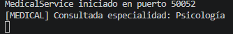
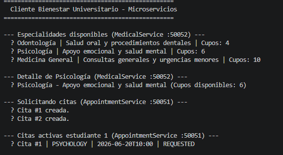

# Ejercicio 6.3 - Descomposición de Bienestar Universitario con gRPC

## Objetivo

A partir del sistema de citas de bienestar universitario desarrollado anteriormente con gRPC, se realizó una primera aproximación hacia una arquitectura basada en microservicios.

El objetivo principal es separar responsabilidades del sistema en servicios independientes que puedan ejecutarse y comunicarse de forma remota.

---

# Marco Teórico

Una arquitectura de microservicios consiste en dividir una aplicación grande en servicios pequeños e independientes, donde cada servicio tiene una responsabilidad específica.

En este ejercicio se utiliza gRPC como mecanismo de comunicación entre servicios, utilizando archivos `.proto` como contrato de comunicación.

Cada servicio expone métodos remotos que pueden ser consumidos por clientes externos.

---

# Diseño de Microservicios

La solución fue dividida en los siguientes servicios:

```
                 +----------------+
                 | WellnessClient |
                 +-------+--------+
                         |
          +--------------+--------------+
          |                             |
          v                             v

+---------------------+       +---------------------+
| AppointmentService  |       |    MedicalService   |
|       :50051        |       |       :50052        |
+---------------------+       +---------------------+

Gestiona citas             Gestiona especialidades
y turnos                  médicas disponibles
```

---

# Servicios Implementados

## AppointmentService

Puerto:

```
50051
```

Responsabilidad:

Gestiona las citas de bienestar universitario.

Operaciones disponibles:

```proto
rpc RequestAppointment
rpc CancelAppointment
rpc GetAppointments
```

Datos manejados:

```
Appointment
-------------
id
studentId
serviceType
date
status
```

Estados posibles:

```
REQUESTED
CANCELLED
ATTENDED
```

Este servicio mantiene la información de citas en memoria.

---

## MedicalService

Puerto:

```
50052
```

Responsabilidad:

Gestionar la información básica de especialidades médicas disponibles.

Operaciones disponibles:

```proto
rpc GetSpecialty
rpc GetAllSpecialties
```

Datos manejados:

```
Specialty
-------------
id
type
name
description
availableSlots
```

Especialidades disponibles:

```
MEDICINE
PSYCHOLOGY
DENTISTRY
```

---

# Contratos gRPC

Se implementaron dos archivos `.proto`.

## AppointmentProto

Define:

```
AppointmentService
Student
Appointment
AppointmentRequest
AppointmentResponse
CancelRequest
CancelResponse
```

---

## MedicalProto

Define:

```
MedicalService
Specialty
SpecialtyRequest
SpecialtyResponse
SpecialtyList
```

Los archivos `.proto` funcionan como contrato entre cliente y servidor, permitiendo generar automáticamente las clases necesarias para la comunicación.

---

# Ejecución del Proyecto

## Compilación

Desde la raíz del proyecto:

```bash
mvn clean compile
```

Resultado esperado:

```
BUILD SUCCESS
```

---

# Ejecutar servicios

Se deben abrir diferentes terminales.

---

## Terminal 1 - AppointmentService

Ejecutar:

```bash
mvn exec:java "-Dexec.mainClass=edu.escuelaing.arsw.ejercicio63.AppointmentServer"
```

Salida esperada:

```
AppointmentService iniciado en puerto 50051
```

---

## Terminal 2 - MedicalService

Ejecutar:

```bash
mvn exec:java "-Dexec.mainClass=edu.escuelaing.arsw.ejercicio63.MedicalServer"
```

Salida esperada:

```
MedicalService iniciado en puerto 50052
```


---

## Terminal 3 - Cliente

Ejecutar:

```bash
mvn exec:java "-Dexec.mainClass=edu.escuelaing.arsw.ejercicio63.WellnessClient"
```




---

# Pruebas Realizadas

El cliente consume directamente los dos servicios implementados.

---

## Consulta de especialidades

Solicitud al:

```
MedicalService :50052
```

Respuesta:

```
Odontología | Salud oral y procedimientos dentales | Cupos: 4

Psicología | Apoyo emocional y salud mental | Cupos: 6

Medicina General | Consultas generales y urgencias menores | Cupos: 10
```

---

## Consulta de una especialidad específica

Solicitud:

```
PSYCHOLOGY
```

Respuesta:

```
Psicología - Apoyo emocional y salud mental
Cupos disponibles: 6
```

---

## Creación de citas

Solicitud al:

```
AppointmentService :50051
```

Resultado:

```
Cita #1 creada.

Cita #2 creada.
```

Las citas quedan almacenadas con estado:

```
REQUESTED
```

---

## Consulta de citas activas

Consulta del estudiante:

```
studentId = 1
```

Respuesta:

```
Cita #1 | PSYCHOLOGY | 2026-06-20T10:00 | REQUESTED
```

---

# Análisis

La solución demuestra una separación inicial del sistema de bienestar universitario.

Cada servicio tiene una responsabilidad específica:

- AppointmentService administra la lógica relacionada con citas.
- MedicalService administra información médica.

La comunicación se realiza mediante gRPC utilizando contratos definidos en archivos protobuf.

Cada servicio puede ejecutarse de forma independiente en un puerto diferente.

---

# Preguntas de Reflexión

## ¿Por qué decidió separar esos servicios y no otros?

Se decidió separar los servicios porque representan responsabilidades diferentes dentro del sistema.

Las citas requieren operaciones como:

- Crear solicitudes.
- Cancelar citas.
- Consultar horarios.

Mientras que la información médica solamente necesita consultar especialidades y disponibilidad.

Separarlos permite que cada servicio pueda evolucionar de manera independiente.

---

## ¿Qué datos pertenecen a cada servicio?

### AppointmentService

Administra:

```
Appointment
Student
ServiceType
AppointmentStatus
```

Su información principal está relacionada con la gestión de turnos.

---

### MedicalService

Administra:

```
Specialty
SpecialtyType
AvailableSlots
```

Su información está relacionada con los servicios médicos disponibles.

---

## ¿Qué riesgo aparece cuando el cliente conoce todos los servicios?

Si el cliente conoce directamente todos los servicios, aumenta el acoplamiento del sistema.

Algunos problemas pueden ser:

- El cliente debe conocer cada puerto.
- Cambios internos pueden afectar al cliente.
- Se pierde parte de la independencia de los servicios.

En arquitecturas reales se suele agregar un API Gateway que funciona como punto único de entrada.

---

# Conclusiones

1. La arquitectura de microservicios permite dividir sistemas grandes en componentes independientes.

2. gRPC facilita la comunicación entre servicios mediante contratos definidos con protobuf.

3. Separar responsabilidades mejora la organización y mantenimiento del código.

4. Cada servicio puede ejecutarse de forma independiente.

5. El cliente puede consumir múltiples servicios remotos utilizando diferentes canales de comunicación.

6. Una evolución futura sería agregar más servicios como GymService y RecreationService siguiendo el mismo modelo.