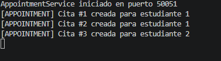
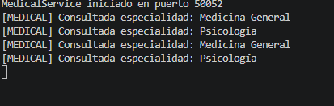
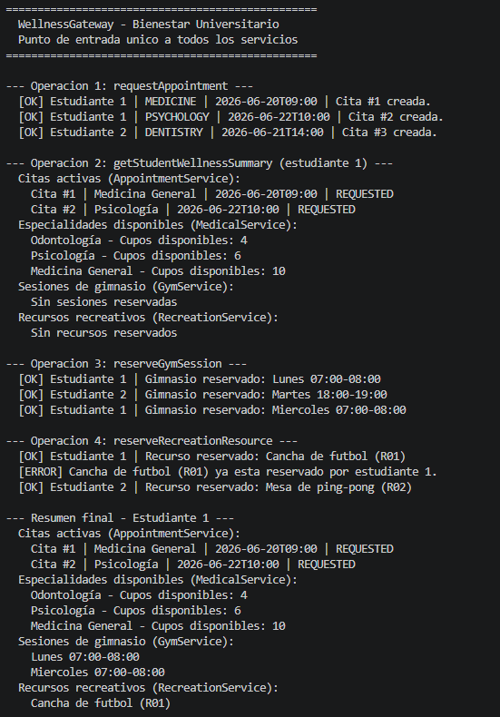

# Ejercicio 7.3 - WellnessGateway: Gateway para Bienestar Universitario

## Objetivo

Construir un Gateway para centralizar el acceso a los diferentes servicios del sistema de bienestar universitario.

El objetivo principal es aplicar un patrón Gateway dentro de una arquitectura distribuida, donde el cliente no necesita conocer directamente cada servicio interno, sino que interactúa con un único punto de entrada que coordina las operaciones.

La solución utiliza los servicios gRPC desarrollados anteriormente:

- AppointmentService
- MedicalService

El Gateway permite abstraer la comunicación entre cliente y servicios internos.

---

# Marco Teórico

En una arquitectura basada en microservicios, los clientes suelen necesitar comunicarse con diferentes servicios independientes.

Sin un Gateway, el cliente tendría que conocer:

- Dirección de cada servicio.
- Puerto utilizado.
- Contratos disponibles.
- Forma de comunicación.


El Gateway funciona como intermediario y ofrece una interfaz más simple para el consumidor.

---

# Desarrollo del Ejercicio

Se implementó la clase:

```
WellnessGateway
```

Esta clase se encarga de:

- Crear conexiones gRPC hacia los servicios internos.
- Ejecutar operaciones combinadas.
- Ocultar la comunicación entre servicios.
- Presentar una interfaz simplificada al cliente.

Los servicios utilizados fueron:

```
AppointmentService
Puerto: 50051

MedicalService
Puerto: 50052
```

---

# Operaciones Implementadas

## requestAppointment(studentId, serviceType)

Permite solicitar una cita mediante el servicio:

```
AppointmentService
```

El Gateway recibe la información del estudiante y realiza la llamada gRPC correspondiente.

Ejemplo:

```
requestAppointment(
 estudiante: 1,
 servicio: MEDICINE
)
```

Respuesta:

```
[OK] Estudiante 1 | MEDICINE | 2026-06-20T09:00 | Cita #1 creada.
```

---

## getStudentWellnessSummary(studentId)

Esta operación combina información de diferentes servicios.

Primero consulta:

```
AppointmentService
```

para obtener las citas activas del estudiante.

Después consulta:

```
MedicalService
```

para obtener información detallada de las especialidades.

Ejemplo:

```
Citas activas:

Cita #1 | Medicina General
2026-06-20T09:00
REQUESTED

Cita #2 | Psicología
2026-06-22T10:00
REQUESTED
```

Además muestra:

```
Especialidades disponibles:

Odontología
Psicología
Medicina General
```

---

## reserveGymSession(studentId, timeSlot)

Simula la reserva de sesiones de gimnasio.

Ejemplo:

```
Estudiante 1

Gimnasio reservado:
Lunes 07:00-08:00
```

La información se mantiene temporalmente en memoria.

---

## reserveRecreationResource(studentId, resourceId)

Permite reservar recursos recreativos.

Recursos disponibles:

```
R01 - Cancha de futbol
R02 - Mesa de ping-pong
R03 - Sala de juegos
```

El Gateway valida si el recurso ya fue reservado.

Ejemplo:

Primera reserva:

```
[OK] Estudiante 1

Recurso reservado:
Cancha de futbol (R01)
```

Segundo intento:

```
[ERROR]

Cancha de futbol ya esta reservado
```


---

# Ejecución del Sistema

Antes de ejecutar el Gateway deben estar activos los servicios internos.

---

## Terminal 1

Ejecutar AppointmentService:

```bash
mvn exec:java "-Dexec.mainClass=edu.escuelaing.arsw.ejercicio63.AppointmentServer"
```

Salida esperada:

```
AppointmentService iniciado en puerto 50051
```


---

## Terminal 2

Ejecutar MedicalService:

```bash
mvn exec:java "-Dexec.mainClass=edu.escuelaing.arsw.ejercicio63.MedicalServer"
```

Salida esperada:

```
MedicalService iniciado en puerto 50052
```



---

## Terminal 3

Ejecutar Gateway:

```bash
mvn exec:java "-Dexec.mainClass=edu.escuelaing.arsw.ejercicio73.WellnessGateway"
```



---

# Pruebas Realizadas

## Solicitud de citas

Salida:

```
--- Operacion 1: requestAppointment ---

[OK] Estudiante 1 | MEDICINE | 2026-06-20T09:00 | Cita #1 creada.

[OK] Estudiante 1 | PSYCHOLOGY | 2026-06-22T10:00 | Cita #2 creada.

[OK] Estudiante 2 | DENTISTRY | 2026-06-21T14:00 | Cita #3 creada.
```

---

## Consulta resumen del estudiante

Salida:

```
--- Operacion 2: getStudentWellnessSummary ---

Citas activas:

Cita #1 | Medicina General | REQUESTED

Cita #2 | Psicología | REQUESTED


Especialidades disponibles:

Odontología
Psicología
Medicina General
```

---

## Reservas de gimnasio

Salida:

```
--- Operacion 3: reserveGymSession ---

[OK] Estudiante 1 | Gimnasio reservado:

Lunes 07:00-08:00


[OK] Estudiante 2 | Gimnasio reservado:

Martes 18:00-19:00
```

---

## Reserva de recursos recreativos

Salida:

```
--- Operacion 4: reserveRecreationResource ---

[OK] Estudiante 1 |
Recurso reservado:
Cancha de futbol (R01)

[ERROR]
Cancha de futbol ya esta reservado

[OK] Estudiante 2 |
Recurso reservado:
Mesa de ping-pong (R02)
```

---

# Análisis

La implementación demuestra cómo un Gateway puede simplificar el acceso a una arquitectura distribuida.

El cliente solamente conoce:

```
WellnessGateway
```

y no necesita conocer:

- Puertos internos.
- Servicios individuales.
- Detalles de comunicación gRPC.

El Gateway coordina las llamadas entre servicios y entrega una respuesta unificada.

---

# Preguntas de Reflexión

## ¿Qué simplifica el Gateway para el cliente?

El Gateway simplifica la interacción porque proporciona un único punto de acceso.

El cliente no necesita administrar múltiples conexiones ni conocer la ubicación de cada microservicio.

En lugar de comunicarse directamente con:

```
AppointmentService
MedicalService
GymService
RecreationService
```

solamente consume:

```
WellnessGateway
```

Esto reduce el acoplamiento entre el cliente y la arquitectura interna.

---

## ¿Qué complejidad agrega al sistema?

Aunque simplifica al cliente, agrega una nueva capa dentro de la arquitectura.

El Gateway debe encargarse de:

- Mantener conexiones con servicios internos.
- Manejar errores de comunicación.
- Coordinar respuestas.
- Transformar información cuando sea necesario.

También puede convertirse en un punto crítico si no se diseña correctamente.

---

## ¿Qué pasaría si el Gateway empieza a contener demasiada lógica de negocio?

Si el Gateway empieza a almacenar reglas del negocio pierde su propósito principal.

Su responsabilidad debería ser:

- Enrutamiento.
- Coordinación.
- Adaptación de respuestas.

La lógica del negocio debe permanecer dentro de cada microservicio.

Si el Gateway crece demasiado puede convertirse en un "monolito distribuido", donde muchas responsabilidades terminan concentradas en un solo componente.

---

# Conclusiones

1. Un Gateway permite centralizar el acceso a múltiples microservicios.

2. Reduce el acoplamiento entre clientes y servicios internos.

3. Facilita operaciones que requieren consultar varios servicios.

4. La lógica del negocio debe mantenerse separada dentro de cada servicio.

5. gRPC permite una comunicación eficiente entre componentes distribuidos.

6. El Gateway mejora la experiencia del cliente al ocultar detalles internos de la arquitectura.

7. Una correcta separación de responsabilidades evita que el Gateway se convierta en un punto de alta complejidad.