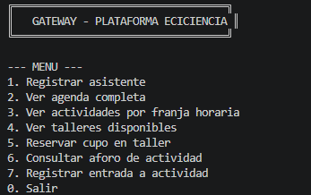
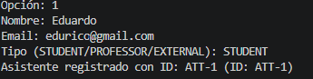
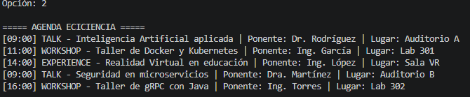
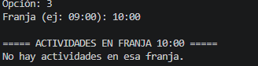
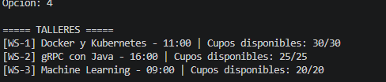
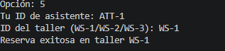
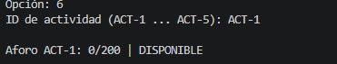
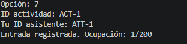

# Ejercicio 8 - Plataforma ECICIENCIA

## Objetivo

Diseñar e implementar la arquitectura distribuida de una plataforma para apoyar la gestión del evento ECICIENCIA de la Escuela Colombiana de Ingeniería Julio Garavito. El sistema permite registrar asistentes, consultar la agenda del evento, reservar cupos en talleres y controlar el aforo de cada actividad, todo mediante una arquitectura de microservicios con gRPC y un API Gateway como punto de entrada único.

---

## Marco Teórico

Una arquitectura de microservicios consiste en dividir una aplicación en servicios pequeños, independientes y altamente cohesivos, donde cada uno tiene una responsabilidad clara y puede evolucionar de forma autónoma. En este ejercicio se utiliza gRPC como mecanismo de comunicación entre servicios, empleando archivos `.proto` como contratos formales que definen los mensajes y operaciones disponibles. Un API Gateway actúa como punto de entrada único para el cliente, evitando que este deba conocer las direcciones y puertos de cada microservicio interno.

---

## Microservicios Identificados

El sistema fue descompuesto en cuatro microservicios, cada uno con una responsabilidad claramente delimitada:

| Servicio | Responsabilidad | Puerto |
|---|---|---|
| AttendeeService | Registrar y consultar asistentes al evento | 50071 |
| AgendaService | Gestionar la agenda completa y consulta por franja horaria | 50072 |
| WorkshopService | Gestionar reservas y cancelaciones de cupos en talleres | 50073 |
| CapacityService | Controlar el aforo en tiempo real de cada actividad | 50074 |

---

## Descripción de Cada Servicio

### AttendeeService

Puerto: `50051`

Responsabilidad: gestionar el registro de asistentes al evento ECICIENCIA, incluyendo estudiantes, profesores y visitantes externos.

Operaciones disponibles:

```proto
rpc RegisterAttendee (RegisterRequest)  returns (RegisterResponse);
rpc GetAttendee      (AttendeeRequest)  returns (AttendeeResponse);
```

Datos gestionados:

attendee_id

name

email

type  (STUDENT, PROFESSOR, EXTERNAL)

---


### AgendaService

Puerto: `50072`

Responsabilidad: gestionar la agenda completa del evento y permitir la consulta de actividades por franja horaria.

Operaciones disponibles:

```proto
rpc GetFullAgenda       (EmptyAgendaRequest) returns (ActivityList);
rpc GetActivitiesBySlot (TimeSlotRequest)    returns (ActivityList);
```

Datos gestionados:

activity_id

title

speaker

time_slot

location

type  (TALK, WORKSHOP, EXPERIENCE)

---

### WorkshopService

Puerto: `50073`

Responsabilidad: gestionar la reserva y cancelación de cupos en los talleres del evento.

Operaciones disponibles:

```proto
rpc GetWorkshops      (EmptyWorkshopRequest)  returns (WorkshopList);
rpc ReserveSpot       (ReserveSpotRequest)    returns (ReserveSpotResponse);
rpc CancelReservation (CancelSpotRequest)     returns (CancelSpotResponse);
```

Datos gestionados:

workshop_id

title

instructor

time_slot

capacity

reserved

---

### CapacityService

Puerto: `50074`

Responsabilidad: controlar el aforo en tiempo real de cada actividad del evento, registrando entradas y verificando disponibilidad.

Operaciones disponibles:

```proto
rpc GetCapacityStatus (CapacityRequest) returns (CapacityResponse);
rpc RegisterEntry     (EntryRequest)    returns (EntryResponse);
```

Datos gestionados:

activity_id

max_capacity

current

available

---

## Contratos gRPC Propuestos

Se implementaron cuatro archivos `.proto` como contratos formales de comunicación:

`attendee.proto` define el contrato para el registro y consulta de asistentes, incluyendo los mensajes `RegisterRequest`, `RegisterResponse`, `AttendeeRequest` y `AttendeeResponse`.

`agenda.proto` define el contrato para la consulta de la agenda, incluyendo los mensajes `EmptyAgendaRequest`, `TimeSlotRequest`, `Activity` y `ActivityList`.

`workshop.proto` define el contrato para la gestión de reservas en talleres, incluyendo los mensajes `ReserveSpotRequest`, `ReserveSpotResponse`, `CancelSpotRequest`, `CancelSpotResponse`, `Workshop` y `WorkshopList`.

`capacity.proto` define el contrato para el control de aforo, incluyendo los mensajes `CapacityRequest`, `CapacityResponse`, `EntryRequest` y `EntryResponse`.

---

## API Gateway - EcicienciaGateway

El `EcicienciaGateway` centraliza el acceso del cliente a todos los microservicios internos. El cliente únicamente interactúa con el Gateway a través de un menú de consola, sin necesidad de conocer los puertos ni las direcciones de cada servicio.

Operaciones disponibles desde el Gateway:

- Registrar un asistente al evento.
- Consultar la agenda completa de ECICIENCIA.
- Consultar actividades por franja horaria.
- Ver talleres disponibles con sus cupos.
- Reservar un cupo en un taller específico.
- Consultar el aforo actual de una actividad.
- Registrar la entrada de un asistente a una actividad.

El Gateway abre internamente un canal gRPC hacia cada microservicio y unifica la respuesta para el usuario final.

---

## Ejecución del Sistema

Se requieren cinco terminales abiertas simultáneamente.

**Terminal 1 - AttendeeService:**
```bash
mvn exec:java "-Dexec.mainClass=edu.escuelaing.arsw.ejercicio8.AttendeeServiceServer"
```
Salida:


**Terminal 2 - AgendaService:**
```bash
mvn exec:java "-Dexec.mainClass=edu.escuelaing.arsw.ejercicio8.AgendaServiceServer"
```
Salida:


**Terminal 3 - WorkshopService:**
```bash
mvn exec:java "-Dexec.mainClass=edu.escuelaing.arsw.ejercicio8.WorkshopServiceServer"
```
Salida:


**Terminal 4 - CapacityService:**
```bash
mvn exec:java "-Dexec.mainClass=edu.escuelaing.arsw.ejercicio8.CapacityServiceServer"
```
Salida:


**Terminal 5 - EcicienciaGateway:**
```bash
mvn exec:java "-Dexec.mainClass=edu.escuelaing.arsw.ejercicio8.EcicienciaGateway"
```



---

## Pruebas Realizadas
















---

## Preguntas de Reflexión

### ¿Por qué se eligió separar estos microservicios y no otros?

Los servicios fueron separados porque representan responsabilidades completamente distintas dentro del sistema. El registro de asistentes es una operación de identidad que no tiene relación directa con la agenda ni con el aforo. La agenda gestiona información de actividades que es relativamente estática durante el evento. El servicio de talleres maneja lógica de reservas con control de cupos que puede cambiar con alta frecuencia. El servicio de aforo controla el ingreso físico de personas en tiempo real, lo que implica una responsabilidad operacional diferente a la de una reserva previa. Separar estos servicios permite que cada uno evolucione, escale y falle de forma independiente.

### ¿Qué datos pertenecen a cada servicio?

Cada servicio es dueño exclusivo de sus datos. El AttendeeService gestiona la información de identidad de los asistentes. El AgendaService gestiona las actividades, ponentes y franjas horarias del evento. El WorkshopService gestiona los talleres, su capacidad y las reservas por asistente. El CapacityService gestiona el aforo real por actividad, es decir, cuántas personas han ingresado físicamente. Ningún servicio accede directamente a los datos de otro; la comunicación siempre ocurre a través de los contratos gRPC definidos en los archivos `.proto`.

### ¿Qué simplifica el API Gateway para el cliente?

El Gateway elimina la necesidad de que el cliente conozca los puertos, direcciones y contratos individuales de cada microservicio. El cliente solo interactúa con un punto de entrada único que oculta la complejidad interna del sistema. Además, el Gateway puede combinar respuestas de varios servicios en una sola operación, como ocurre al consultar actividades y su aforo simultáneamente. Esto reduce el acoplamiento entre el cliente y la arquitectura interna.

### ¿Qué complejidad agrega el Gateway al sistema?

El Gateway introduce un componente adicional que debe mantenerse operativo en todo momento. Si el Gateway falla, el cliente pierde acceso a todos los servicios aunque estos funcionen correctamente. Además, el Gateway puede convertirse en un cuello de botella si no se gestiona adecuadamente su escalabilidad. En arquitecturas reales se requieren estrategias de alta disponibilidad, balanceo de carga y monitoreo específico del Gateway para mitigar estos riesgos.

### ¿Por qué no se utilizaría un único servicio monolítico para todo?

Un sistema monolítico concentraría todas las responsabilidades en un solo proceso. Cualquier fallo en una funcionalidad, como un error en el control de aforo, podría afectar el registro de asistentes o la consulta de la agenda. Además, escalar el sistema implicaría replicar todo el monolito aunque solo una parte esté bajo alta demanda. Con microservicios, cada componente puede escalar, actualizarse y desplegarse de forma independiente, lo que mejora la resiliencia y la mantenibilidad del sistema.

### ¿Qué pasaría si el Gateway empieza a contener demasiada lógica de negocio?

Si el Gateway acumula lógica de negocio se convierte en un anti-patrón conocido como "God Gateway". En ese caso el Gateway deja de ser un enrutador y se convierte en un servicio con responsabilidades propias, lo que contradice el principio de separación de responsabilidades. La lógica de negocio debe residir en los microservicios correspondientes, y el Gateway debe limitarse a enrutar, agregar respuestas y gestionar la comunicación con el cliente sin tomar decisiones de dominio.

---

## Conclusiones

1. La arquitectura de microservicios permite dividir un sistema complejo como ECICIENCIA en componentes independientes con responsabilidades claras, facilitando su mantenimiento y evolución.

2. Los archivos `.proto` funcionan como contratos formales de comunicación que garantizan consistencia entre cliente y servidor independientemente del lenguaje de implementación.

3. gRPC es una tecnología apropiada para la comunicación entre microservicios gracias a su eficiencia en serialización mediante Protocol Buffers y su soporte para contratos tipados.

4. El API Gateway es un patrón arquitectónico que simplifica la interacción del cliente con el sistema al centralizar el acceso y ocultar la complejidad interna de los microservicios.

5. La separación de responsabilidades entre AttendeeService, AgendaService, WorkshopService y CapacityService permite que cada servicio falle, escale y evolucione de forma autónoma sin afectar a los demás.

6. Este ejercicio integrador demostró que la evolución desde un servidor TCP básico hasta una arquitectura de microservicios con API Gateway no es solo un cambio tecnológico, sino una respuesta a problemas concretos de acoplamiento, escalabilidad y mantenibilidad en sistemas distribuidos reales.